# 📊 Diagrammes de Flow - Codes Promo

## Flow Principal d'Utilisation

```mermaid
flowchart TD
    A[Admin crée code promo] --> B[Code stocké en BDD]
    B --> C[Client démarre réservation]
    C --> D{Client saisit<br/>code promo?}
    
    D -->|Non| E[Création transport<br/>sans réduction]
    D -->|Oui| F[Validation temps réel]
    
    F --> G{Code valide?}
    G -->|Non| H[Message d'erreur<br/>Client ressaisit]
    G -->|Oui| I[Affichage prix réduit]
    
    H --> D
    I --> J[Confirmation réservation]
    J --> K[Transport créé avec<br/>code promo lié]
    
    K --> L[Transport en cours]
    L --> M[Transport terminé]
    M --> N[Calcul montant final]
    N --> O[Application réduction]
    
    O --> P{Mode paiement?}
    P -->|Stripe| Q[Paiement carte<br/>montant net]
    P -->|Cash| R[Paiement espèces<br/>montant net]
    
    Q --> S{Paiement réussi?}
    R --> T[Chauffeur confirme<br/>réception]
    
    S -->|Oui| U[Incrémentation<br/>usage code]
    S -->|Non| V[Gestion erreur<br/>paiement]
    T --> U
    
    U --> W[Transport finalisé]
    E --> L

    style A fill:#e1f5fe
    style U fill:#c8e6c9
    style W fill:#4caf50
    style H fill:#ffcdd2
    style V fill:#ffcdd2
```

## Validation d'un Code Promo

```mermaid
flowchart TD
    A[Requête validation] --> B[Recherche code en BDD]
    B --> C{Code existe?}
    
    C -->|Non| D[Erreur: Code invalide]
    C -->|Oui| E{Code actif?}
    
    E -->|Non| F[Erreur: Code inactif]
    E -->|Oui| G{Date expiration<br/>dépassée?}
    
    G -->|Oui| H[Erreur: Code expiré]
    G -->|Non| I{Limite usage<br/>atteinte?}
    
    I -->|Oui| J[Erreur: Code épuisé]
    I -->|Non| K{Montant minimum<br/>respecté?}
    
    K -->|Non| L[Erreur: Montant<br/>minimum requis]
    K -->|Oui| M[Calcul réduction]
    
    M --> N[Retour informations<br/>réduction]

    style D fill:#ffcdd2
    style F fill:#ffcdd2
    style H fill:#ffcdd2
    style J fill:#ffcdd2
    style L fill:#ffcdd2
    style N fill:#c8e6c9
```

## Architecture des Modules

## States d'un Code Promo

```mermaid
stateDiagram-v2
    [*] --> Créé: Admin crée le code
    
    Créé --> Actif: Code activé
    Créé --> Inactif: Code désactivé
    
    Actif --> Utilisé: Client utilise le code
    Actif --> Expiré: Date d'expiration atteinte
    Actif --> Épuisé: Limite d'usage atteinte
    Actif --> Inactif: Admin désactive
    
    Utilisé --> Actif: Encore des utilisations possibles
    Utilisé --> Épuisé: Limite d'usage atteinte
    Utilisé --> Expiré: Date d'expiration atteinte
    
    Inactif --> Actif: Admin réactive
    Inactif --> Supprimé: Admin supprime
    
    Expiré --> [*]: Nettoyage automatique
    Épuisé --> [*]: Nettoyage automatique
    Supprimé --> [*]
```

## Flow de Paiement avec Codes Promo

```mermaid
sequenceDiagram
    participant C as Client
    participant API as API Backend
    participant DB as Database
    participant S as Stripe
    participant D as Chauffeur

    Note over C,D: Création Transport avec Code Promo
    
    C->>API: POST /transports (avec promoCode)
    API->>DB: Valider code promo
    DB-->>API: Code valide + règles
    API->>API: Calculer réduction
    API->>DB: Créer transport avec réduction
    API-->>C: Transport créé (montant réduit)
    
    Note over C,D: Fin de Transport
    
    D->>API: Terminer transport
    API->>DB: Calculer montant final
    API->>API: Appliquer réduction
    
    alt Paiement Stripe
        API->>S: Charger montant net
        S-->>API: Paiement confirmé
        API->>DB: Incrémenter usage code
    else Paiement Cash
        API->>D: Montant à recevoir (net)
        D->>API: Confirmer réception
        API->>DB: Incrémenter usage code
    end
    
    API-->>C: Transport finalisé
```

