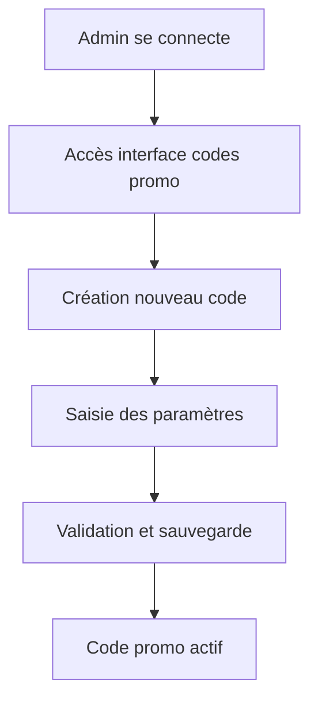
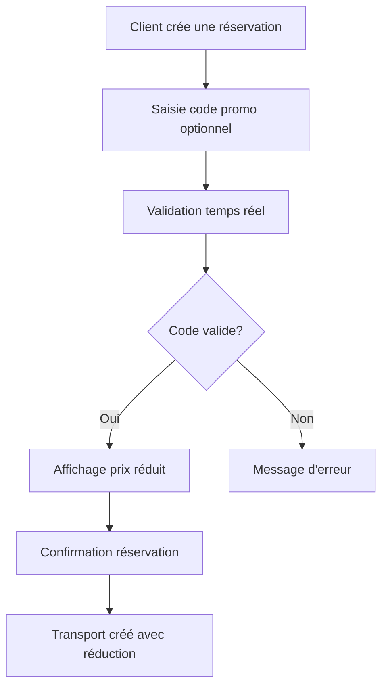
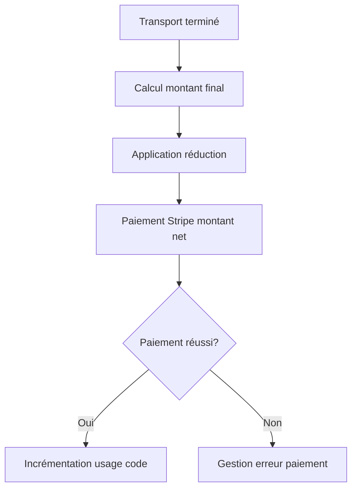
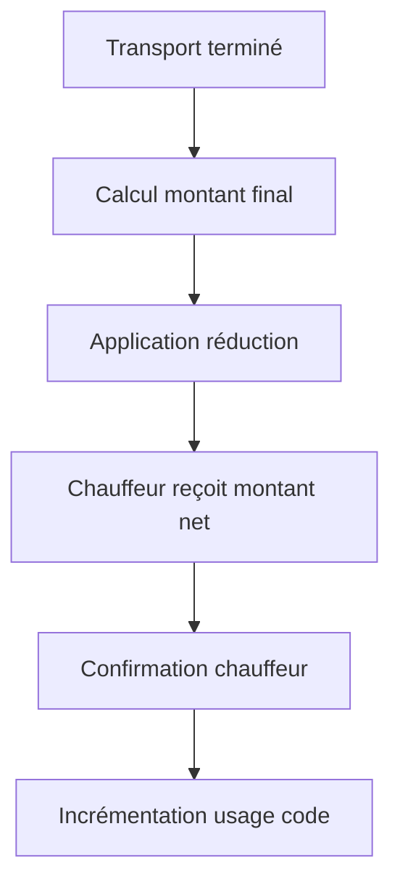

# 🎫 Système de Codes Promo - Documentation Technique

## Vue d'ensemble

Le système de codes promo permet aux administrateurs de créer des codes de réduction et aux clients de les utiliser lors de leurs réservations de transport. Cette fonctionnalité supporte deux modes de paiement : **Stripe** (carte bancaire) et **Cash** (espèces).

## 📋 Table des matières

1. [Architecture](#architecture)
2. [Modèle de données](#modèle-de-données)
3. [Flow utilisateur](#flow-utilisateur)
4. [API Endpoints](#api-endpoints)
5. [Exemples d'usage](#exemples-dusage)
6. [Gestion des erreurs](#gestion-des-erreurs)
7. [Tests](#tests)

---

## Architecture

### Composants principaux

```
┌─────────────────┐    ┌─────────────────┐    ┌─────────────────┐
│   PromoCode     │    │   Transport     │    │   Payment       │
│   Module        │────│   Module        │────│   (Stripe/Cash) │
└─────────────────┘    └─────────────────┘    └─────────────────┘
         │                        │                        │
         ▼                        ▼                        ▼
┌─────────────────┐    ┌─────────────────┐    ┌─────────────────┐
│ Admin Interface │    │ Client App      │    │ Driver App      │
│ (Gestion codes) │    │ (Utilisation)   │    │ (Confirmation)  │
└─────────────────┘    └─────────────────┘    └─────────────────┘
```

### Technologies utilisées

- **Backend** : NestJS + TypeScript
- **Base de données** : PostgreSQL + Prisma ORM
- **Paiements** : Stripe API
- **Validation** : class-validator + class-transformer

---

## Modèle de données

### Table `PromoCode`

```sql
CREATE TABLE "PromoCode" (
  id                SERIAL PRIMARY KEY,
  code              VARCHAR UNIQUE NOT NULL,
  description       VARCHAR,
  typeReduction     VARCHAR NOT NULL, -- 'PERCENTAGE' | 'FIXED_AMOUNT'
  valeurReduction   FLOAT NOT NULL,
  dateExpiration    TIMESTAMP,
  utilisationsMax   INTEGER,
  utilisations      INTEGER DEFAULT 0,
  montantMinimum    FLOAT,
  actif             BOOLEAN DEFAULT true,
  createdAt         TIMESTAMP DEFAULT now(),
  updatedAt         TIMESTAMP DEFAULT now()
);
```

### Relation avec Transport

```sql
-- Ajouts à la table Transport
ALTER TABLE "Transport" ADD COLUMN promoCodeId INTEGER;
ALTER TABLE "Transport" ADD COLUMN montantReduction FLOAT DEFAULT 0;
ALTER TABLE "Transport" ADD FOREIGN KEY (promoCodeId) REFERENCES "PromoCode"(id);
```

### Types TypeScript

```typescript
interface PromoCode {
  id: number;
  code: string;
  description?: string;
  typeReduction: 'PERCENTAGE' | 'FIXED_AMOUNT';
  valeurReduction: number;
  dateExpiration?: Date;
  utilisationsMax?: number;
  utilisations: number;
  montantMinimum?: number;
  actif: boolean;
  createdAt: Date;
  updatedAt: Date;
}
```

---

## Flow utilisateur

### 1. Création d'un code promo (Admin)



**Paramètres configurables :**
- Code unique (ex: `WELCOME2025`)
- Description (ex: "Offre de bienvenue")
- Type de réduction (`PERCENTAGE` ou `FIXED_AMOUNT`)
- Valeur (20 pour 20% ou 15 pour 15€)
- Date d'expiration (optionnel)
- Nombre d'utilisations maximum (optionnel)
- Montant minimum de course (optionnel)

### 2. Utilisation par le client



### 3. Finalisation et paiement

#### Paiement Stripe


#### Paiement Cash


---

## API Endpoints

### Gestion administrative (Protégé par JWT + AdminGuard)

#### 📋 Lister tous les codes
```http
GET /api/promo-codes
Authorization: Bearer {token}
```

**Réponse :**
```json
[
  {
    "id": 1,
    "code": "WELCOME2025",
    "description": "Offre de bienvenue",
    "typeReduction": "PERCENTAGE",
    "valeurReduction": 20,
    "dateExpiration": "2025-12-31T23:59:59Z",
    "utilisationsMax": 100,
    "utilisations": 15,
    "montantMinimum": 25,
    "actif": true,
    "_count": {
      "transports": 15
    }
  }
]
```

#### ➕ Créer un code
```http
POST /api/promo-codes
Authorization: Bearer {token}
Content-Type: application/json

{
  "code": "SUMMER2025",
  "description": "Réduction d'été",
  "typeReduction": "FIXED_AMOUNT",
  "valeurReduction": 10,
  "dateExpiration": "2025-09-30T23:59:59Z",
  "utilisationsMax": 50,
  "montantMinimum": 30
}
```

#### 📝 Modifier un code
```http
PATCH /api/promo-codes/1
Authorization: Bearer {token}
Content-Type: application/json

{
  "actif": false
}
```

#### 🗑️ Supprimer un code
```http
DELETE /api/promo-codes/1
Authorization: Bearer {token}
```

### Utilisation publique

#### ✅ Valider un code promo
```http
POST /api/promo-codes/validate
Content-Type: application/json

{
  "code": "WELCOME2025",
  "montantCourse": 45.50
}
```

**Réponse succès :**
```json
{
  "valid": true,
  "promoCode": {
    "id": 1,
    "code": "WELCOME2025",
    "typeReduction": "PERCENTAGE",
    "valeurReduction": 20
  },
  "montantOriginal": 45.50,
  "montantReduction": 9.10,
  "montantFinal": 36.40
}
```

**Réponse erreur :**
```json
{
  "statusCode": 400,
  "message": "Code promo expiré",
  "error": "Bad Request"
}
```

### Intégration transport

#### 🚗 Créer un transport avec code promo
```http
POST /api/transports
Authorization: Bearer {token}
Content-Type: application/json

{
  "clientId": 1,
  "vehiculeId": 1,
  "adresseDepart": "123 rue de la Paix, Paris",
  "adresseDestination": "456 avenue des Champs, Paris",
  "departLatitude": 48.8566,
  "departLongitude": 2.3522,
  "destinationLatitude": 48.8738,
  "destinationLongitude": 2.2950,
  "paymentMethod": "STRIPE",
  "promoCode": "WELCOME2025"
}
```

---

## Exemples d'usage

### Scénario 1 : Réduction en pourcentage

```javascript
// Code promo : 20% de réduction
const promoCode = {
  code: "REDUCTION20",
  typeReduction: "PERCENTAGE",
  valeurReduction: 20
};

// Course de 50€
const montantCourse = 50;
const reduction = montantCourse * (20 / 100); // 10€
const montantFinal = montantCourse - reduction; // 40€
```

### Scénario 2 : Réduction fixe

```javascript
// Code promo : 15€ de réduction
const promoCode = {
  code: "FIXE15",
  typeReduction: "FIXED_AMOUNT",
  valeurReduction: 15
};

// Course de 50€
const montantCourse = 50;
const reduction = Math.min(15, montantCourse); // 15€
const montantFinal = montantCourse - reduction; // 35€
```

### Scénario 3 : Avec montant minimum

```javascript
// Code promo : 10€ de réduction si course > 25€
const promoCode = {
  code: "MIN25",
  typeReduction: "FIXED_AMOUNT",
  valeurReduction: 10,
  montantMinimum: 25
};

// Course de 20€ - INVALIDE
if (20 < 25) {
  throw new Error("Montant minimum de 25€ requis");
}

// Course de 30€ - VALIDE
const montantFinal = 30 - 10; // 20€
```

---

## Gestion des erreurs

### Types d'erreurs possibles

| Code d'erreur | Message | Cause |
|---------------|---------|-------|
| `400` | Code promo invalide | Code inexistant |
| `400` | Code promo inactif | Code désactivé par admin |
| `400` | Code promo expiré | Date d'expiration dépassée |
| `400` | Code promo épuisé | Limite d'utilisation atteinte |
| `400` | Montant minimum requis | Course en dessous du seuil |
| `400` | Ce code promo existe déjà | Tentative de création avec code dupliqué |
| `404` | Code promo non trouvé | ID invalide pour modification/suppression |

### Gestion côté client

```typescript
try {
  const result = await validatePromoCode('INVALID_CODE', 100);
  // Utiliser result.montantFinal
} catch (error) {
  if (error.status === 400) {
    // Afficher message d'erreur à l'utilisateur
    showError(error.message);
  }
}
```

---

## Tests

### Tests unitaires recommandés

#### Service PromoCodesService

```typescript
describe('PromoCodesService', () => {
  describe('validateAndGetCode', () => {
    it('should validate active code', async () => {
      // Test code actif et valide
    });

    it('should reject expired code', async () => {
      // Test code expiré
    });

    it('should reject inactive code', async () => {
      // Test code inactif
    });

    it('should reject when usage limit reached', async () => {
      // Test limite d'utilisation
    });

    it('should reject when minimum amount not met', async () => {
      // Test montant minimum
    });
  });

  describe('calculateDiscount', () => {
    it('should calculate percentage discount correctly', async () => {
      // Test calcul pourcentage
    });

    it('should calculate fixed amount discount correctly', async () => {
      // Test calcul montant fixe
    });

    it('should not exceed course amount for fixed discount', async () => {
      // Test que la réduction ne dépasse pas le montant de la course
    });
  });
});
```

#### Intégration TransportsService

```typescript
describe('TransportsService with PromoCode', () => {
  it('should create transport with valid promo code', async () => {
    // Test création transport avec code valide
  });

  it('should reject transport with invalid promo code', async () => {
    // Test rejet avec code invalide
  });

  it('should increment usage after successful transport', async () => {
    // Test incrémentation usage après finalisation
  });
});
```

### Tests d'intégration (E2E)

```typescript
describe('PromoCode Flow (E2E)', () => {
  it('should complete full promo code journey', async () => {
    // 1. Admin crée un code promo
    const promoCode = await createPromoCode({
      code: 'TEST2025',
      typeReduction: 'PERCENTAGE',
      valeurReduction: 15
    });

    // 2. Client valide le code
    const validation = await validatePromoCode('TEST2025', 100);
    expect(validation.montantFinal).toBe(85);

    // 3. Client crée un transport avec le code
    const transport = await createTransport({
      // ... données transport
      promoCode: 'TEST2025'
    });

    // 4. Transport se termine et usage est incrémenté
    await endTransport(transport.id);
    
    const updatedCode = await getPromoCode(promoCode.id);
    expect(updatedCode.utilisations).toBe(1);
  });
});
```

---

## 🚀 Mise en production

### Checklist avant déploiement

- [ ] Migration Prisma appliquée : `npx prisma migrate deploy`
- [ ] Client Prisma généré : `npx prisma generate`
- [ ] AdminGuard configuré pour protéger les endpoints
- [ ] Variables d'environnement configurées
- [ ] Tests unitaires et d'intégration passants
- [ ] Documentation API mise à jour
- [ ] Monitoring des erreurs configuré

### Surveillance recommandée

- Nombre de codes promo créés par jour
- Taux d'utilisation des codes promo
- Montant total des réductions accordées
- Erreurs de validation les plus fréquentes

---

## 📞 Support

Pour toute question ou problème technique, consulter :
- Cette documentation
- Les tests unitaires dans `/src/promo-codes/__tests__/`
- Les logs de l'application
- L'équipe de développement

---

*Dernière mise à jour : Août 2025*
